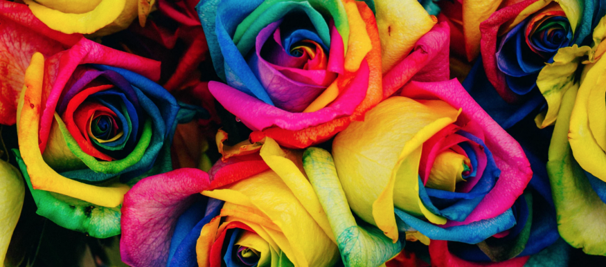
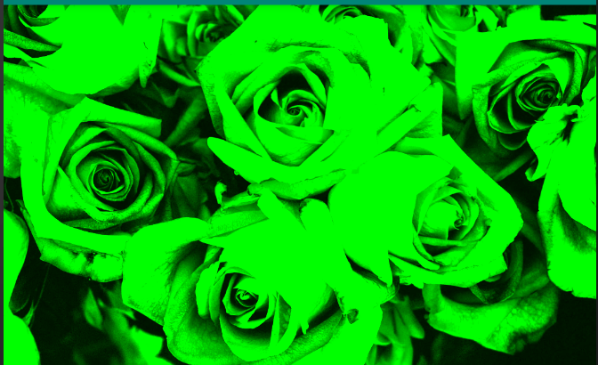
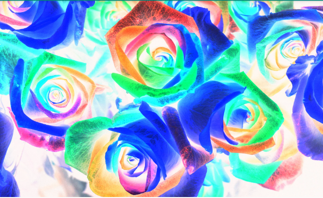

# ImageFiltersLibrary-Android
[](https://jitpack.io/#YardenBarakDev/FiltersLibrary)


A library for simple implementation of Filters. the user will be able to set an Image using Glide(https://github.com/bumptech/glide) and add filters to the image.

Picture by Denise Chan on Unsplash

Original image




Red Filter


Green filter





Grey Filter


Invert Filter





Color swap


##
Step 1. Add it in your root build.gradle at the end of repositories:

	allprojects {
		repositories {
			...
			maven { url 'https://jitpack.io' }
		}
	}
 
  
Step 2. Add the dependency

	dependencies {
	         implementation 'com.github.YardenBarakDev:FiltersLibrary:v1.0'
	}
  
  
  ## Usage
  

  ###### initiate 
  
  ```java
  
ColorFilters colorFilters = new ColorFilters(); 
```

###### Choose filter

  ```java
colorFilters.setFilter(main_IMG_image, ColorFilters.filters.INVERT);
```

###### Show image

```java
colorFilters.uploadImage(MainActivity.this, main_IMG_image, R.drawable.image);
```
  //main_IMG_image is the ImageView 
